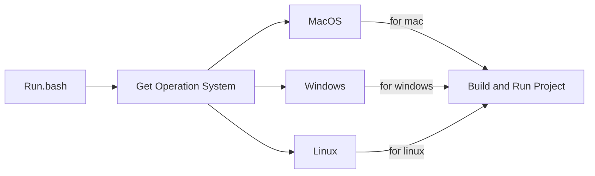
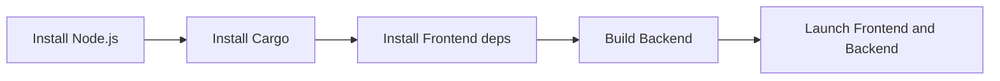
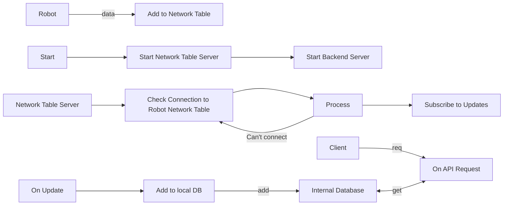

# Methodology

## Launch Process

### Overview

### Launch Process MacOS

### Launch Process Linux

At the moment not supported

### Launch Process Windows

At the moment not supported

## Backend Process

